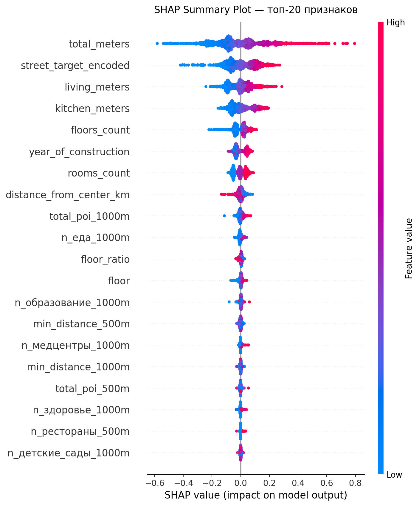

# Прогнозирование цен на недвижимость г. Омска с учётом геопространственных данных

[](https://colab.research.google.com/github/sixtis1/omsk-real-estate-prices/blob/main/notebooks/real_estate_prediction.ipynb)


Модель оценки рыночной стоимости квартир по характеристикам объекта и городской среде вокруг него. Датасет: 7 604 объявления о продаже квартир в Омске (cian.ru), обогащённые координатами и данными об инфраструктуре из 2ГИС (1 235 POI-объектов: школы, больницы, кафе, театры и др.).

Лучшая модель — **XGBoost на log(price): MAPE 11,2 %, R² = 0,90, медианная ошибка 414 тыс. ₽**. Для сравнения: линейная регрессия на тех же признаках даёт MAPE 12,9 %, а в публикациях по гедонистическим моделям цен типичный MAPE линейных моделей составляет 18–20 %. Разрыв закрыт в первую очередь инженерией признаков, а не выбором алгоритма.

## Результаты

Сравнение моделей на отложенной выборке (test = 20 %, 1 428 объектов):

| Модель | Признаков | CV MAE, ₽ | Test MAE, ₽ | Median AE, ₽ | MAPE, % | R² |
|---|---|---|---|---|---|---|
| Линейная регрессия (baseline) | 122 | — | 801 438 | 472 696 | 12,87 | 0,839 |
| **XGBoost A (OHE, log)** | **1 397** | **731 218** | **673 438** | **414 300** | **11,18** | **0,898** |
| XGBoost A (OHE, raw) | 1 397 | 737 073 | 691 283 | 426 687 | 11,54 | 0,892 |
| XGBoost B (Target Enc., log) | 122 | 742 558 | 687 517 | 419 123 | 11,35 | 0,892 |
| XGBoost B (Target Enc., raw) | 122 | 744 737 | 698 944 | 447 234 | 11,79 | 0,892 |
| XGBoost B2 (без living/kitchen, log) | 120 | 767 542 | 704 942 | 414 416 | 11,43 | 0,882 |

Лучшая конфигурация выбиралась по CV MAE (5-fold на train), а не по метрикам на тесте.

Подход B (Target Encoding улицы вместо OHE) проигрывает подходу A всего 0,17 п.п. MAPE при сокращении признакового пространства с 1 397 до 122 признаков — для продакшена это более практичный вариант.

### Ошибка по ценовым сегментам

| Сегмент | Объектов | MAE, тыс. ₽ | MAPE, % |
|---|---|---|---|
| до 2,5 млн | 45 | 669 | 35,9 |
| 2,5–4 млн | 328 | 364 | 10,9 |
| 4–6 млн | 539 | 477 | 9,6 |
| 6–10 млн | 374 | 776 | 10,3 |
| свыше 10 млн | 142 | 1 885 | 12,8 |

Модель стабильна в массовом сегменте (MAPE 9,6–10,9 %) и хуже работает на краях распределения. Дешёвый сегмент малочислен (45 объектов в тесте) и зашумлён нерыночными объявлениями.

### Интерпретация модели (SHAP)



Топ факторов цены по mean |SHAP|: общая площадь, целевое кодирование улицы, жилая площадь и площадь кухни, этажность дома, год постройки, число комнат, удалённость от центра. Инфраструктурные признаки (количество POI в радиусе 500/1000 м) дают вклад на уровне отдельных физических характеристик: например, плотность заведений еды в радиусе 1 км сопоставима по влиянию с этажом квартиры.

## Что внутри пайплайна

1. **Очистка**: парсинг числовых полей из строк, удаление столбцов с >30 % пропусков, фильтр нерыночных объявлений (< 20 тыс. ₽/м²).
2. **Геокодирование и POI-признаки**: join координат по адресу, расчёт матрицы расстояний до 1 235 объектов 2ГИС, 38 признаков вида «число школ в радиусе 1 км», «расстояние до ближайшего POI».
3. **Train/test split до любых статистических преобразований.** Все статистики ниже считаются только по train.
4. **Импутация**: иерархическая для года постройки (адрес → улица → район → медиана; качество проверено на CV: MAE 5,6 года), коэффициенты living/total и kitchen/total по районам, флаги импутации как отдельные признаки.
5. **Выбросы**: winsorizing по перцентилям train.
6. **Кодирование**: три конфигурации признаков (OHE / Target Encoding / Target Encoding без потенциально мультиколлинеарных площадей).
7. **Обучение**: RandomizedSearchCV отдельно для каждой конфигурации, сравнение log- и raw-таргета, выбор по CV MAE.
8. **Анализ**: метрики по сегментам, feature importance, SHAP (summary, dependence, waterfall).

## Ограничения и честные оговорки

- Верхняя граница winsorizing цены применена ко всему датасету, включая тестовый таргет. Граница вычислена по train, но обрезка y_test слегка завышает метрики на дорогих объектах. В следующей итерации клиппинг таргета останется только на train.
- Target Encoding улицы выполнен без сглаживания: улицы с 1–2 объявлениями в train кодируются их собственной ценой, что склонно к переобучению. План: сглаживание к глобальному среднему или out-of-fold кодирование.
- Подбор гиперпараметров для трёх конфигураций сошёлся к одному набору — артефакт общего random_state в RandomizedSearchCV (одинаковая сетка кандидатов). Требует увеличения n_iter.
- Данные — срез одного города за один период; модель не учитывает динамику рынка во времени.

## Как запустить

```bash
git clone https://github.com/sixtis1/omsk-real-estate-prices.git
cd REPO
pip install -r requirements.txt
```

Поместите файлы данных (схема описана в [data/README.md](data/README.md)) в `data/` и запустите ноутбук:

```bash
jupyter notebook notebooks/real_estate_prediction.ipynb
```

Либо откройте ноутбук в Colab по бейджу выше и загрузите данные в `/content/`.

## Структура репозитория

```
├── notebooks/
│   └── real_estate_prediction.ipynb   # полный пайплайн: очистка → признаки → модели → SHAP
├── reports/figures/                   # графики SHAP, таблицы сравнения моделей
├── data/                              # данные (не публикуются), см. data/README.md
├── requirements.txt
└── README.md
```

## Стек

Python 3.12 · pandas · NumPy · SciPy · scikit-learn · XGBoost · SHAP · matplotlib
